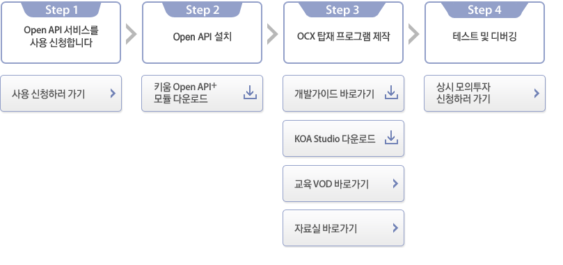

# 키움증권 OpenApi

 

+ [키움 Open API+](https://www1.kiwoom.com/nkw.templateFrameSet.do?m=m1408000000)

+ [키움 OpenAPI+ 개발가이드 PDF](https://download.kiwoom.com/web/openapi/kiwoom_openapi_plus_devguide_ver_1.5.pdf)

+ [키움 OpenAPI 교육 VOD](https://www.howtostock.com/acdm/getLectureList.action?COUR_SEQ=49&CURR_SEQ=218)

  

### Kiwoom OpenAPI Contents

+ [키움증권 OpenApi](#키움증권-openapi)

    + [Kiwoom OpenAPI Contents](#kiwoom-openapi-contents)
    + [Kiwoom OpenApi](#kiwoom-openapi)
    + [OpenAPI Step](#openapi-step)
    + [kiwoom OpenAPI ErrorMsg](#kiwoom-openapi-errormsg)

 

### Kiwoom OpenApi

 

 

### OpenAPI Step

+ ##### Step1

   + OpenApi 서비스 사용 신청

+ ##### Step2

    + 키움 Open API+ 모듈 다운로드

+ ##### Step3

    + 개발가이드
    + KOA Studio
    + 교육 VOD
    + 자료실

+ ##### Step4

    + 상시 모의투자 신청

 

### kiwoom OpenAPI ErrorMsg

