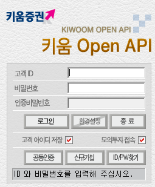
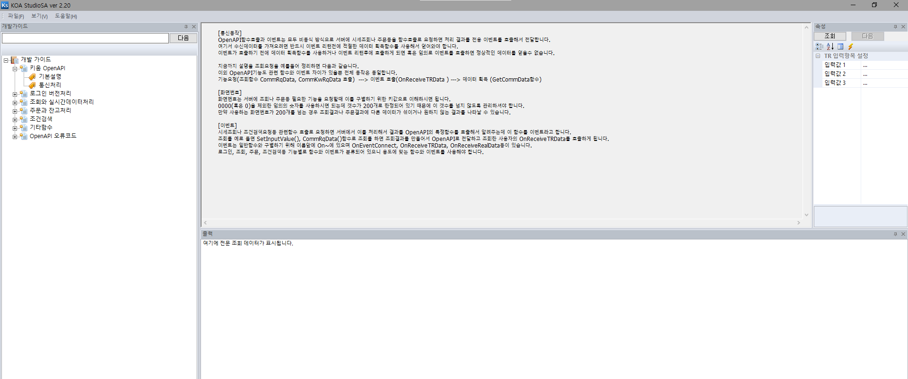
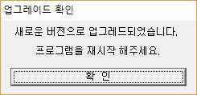
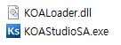
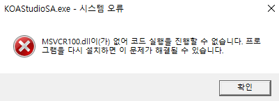
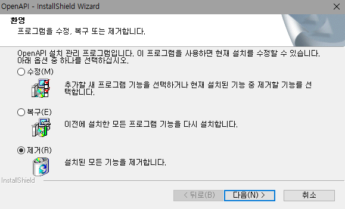

# 키움증권 OpenApi

<br>

+ [키움 Open API+](https://www1.kiwoom.com/nkw.templateFrameSet.do?m=m1408000000)

+ [키움 OpenAPI+ 개발가이드 PDF](https://download.kiwoom.com/web/openapi/kiwoom_openapi_plus_devguide_ver_1.5.pdf)

+ [키움 OpenAPI 교육 VOD](https://www.howtostock.com/acdm/getLectureList.action?COUR_SEQ=49&CURR_SEQ=218)

<br><br>

### Kiwoom OpenAPI Contents

* * *

<br>

+ [키움증권 OpenApi](#키움증권-openapi)

    + [Kiwoom OpenAPI Contents](#kiwoom-openapi-contents)
    + [Kiwoom OpenApi](#kiwoom-openapi)
    + [OpenAPI Step](#openapi-step)
    + [kiwoom OpenAPI ErrorMsg](#kiwoom-openapi-errormsg)

<br>

### Kiwoom OpenApi

* * *

<br>

<p align="center"></p>

<br>

### OpenAPI Step

* * *

<br>

+ ##### Step1

   + OpenApi 서비스 사용 신청

+ ##### Step2

    + 키움 Open API+ 모듈 다운로드

+ ##### Step3

    + 개발가이드
    + KOA Studio
    + 교육 VOD
    + 자료실

+ ##### Step4

    + 상시 모의투자 신청

<br>

### kiwoom OpenAPI Method

* * *

<br>

+ #### 로그인 버전처리

    <br>

    | 타입 | 이름 | 설명 |
    | ---- | ---- | ---- |
    | LONG | CommConnect() | 수동 로그인설정인 경우 로그인창출력 후 로그인 시도하거나 자동로그인 설정인 경우 자동으로 로그인을 시도합니다. |
    | Void | CommTerminate() | 현재 지원하지않는 함수입니다. |
    | LONG | GetConnectState() | 현재 로그인 상태를 알려줍니다. |
    | LONG | GetLoginInfo() | 로그인 후에만 사용할 수 있으며 인자값에 따라 다양항 정보를 얻을 수 있습니다. |
    | void | OnEventConnect() | 현재 로그인 상태를 알려줍니다. |
    | void | OnReceiveMsg() | 서버통신한 다음 수신한 메시지를 알려줍니다. |

    <br>

    + CommConnect()

        > 수동 로그인설정인 경우 로그인창출력 후 로그인 시도하거나 자동로그인 설정인 경우 자동으로 로그인을 시도합니다.

        [Example python](https://github.com/kimminwyk/PrediCtionMoney/blob/main/kiwoomOpenAPI-testing/python/CLI/kiwoom_CommConnect.py)

        <br>

        ActiveX를 사용하여 KHOPENAPI.KHOpenAPICtrl.1를 불러온 다음 CommConnect()한 다음 
        <br>

        <p align="left"></p>

        이런식으로 로그인 창이 뜨면 성공이다.

        <br>

    + CommTerminate()

        > 현재 지원하지않는 함수입니다.

        <br>

    + GetConnectState()

        > 현재 로그인 상태를 알려줍니다.

        [Example python](https://github.com/kimminwyk/PrediCtionMoney/blob/main/kiwoomOpenAPI-testing/python/CLI/kiwoom_GetConnectState.py)

        GetConnectState 반환값(return)

        | 1 | 0 |
        | - | - |
        | 연결| 연결안됨 |

        <br>

    + GetLoginInfo()

        > 로그인 후에만 사용할 수 있으며 인자값에 따라 다양항 정보를 얻을 수 있습니다. 

        [Example python](https://github.com/kimminwyk/PrediCtionMoney/blob/main/kiwoomOpenAPI-testing/python/CLI/kiwoom_GetLoginInfo.py)

        + #### kiwoom OpanAPI GetLoginInfo() 인자 종류

            + ACCOUNT_CNT
                > 보유계좌 수를 반환합니다.

                <br>
                
            + ACCLIST
                > 구분자 ';'로 연결된 보유계좌 목록을 반환합니다.

                <br>
                
            + USER_ID
                > 사용자 ID를 반환합니다.

                <br>
                
            + USER_NAME
                > 사용자 이름을 반환합니다.

                <br>
                
            + KEY_BSECGB
                > 키보드 보안 해지여부를 반환합니다.(0 : 정상, 1 : 해지)

                <br>
                
            + FIREW_SECGB
                > 방화벽 설정여부를 반환합니다.(0 : 미설정, 1 : 설정, 2 : 해지)

                <br>
                
            + GetServerGubun
                > 접속서버 구분을 반환합니다.(1 : 모의투자, 나머지 : 실서버)

                <br>
                

        <br>

    + OnEventConnect()

        > 현재 로그인 상태를 알려줍니다.

        <br>

    + OnReceivMsg()

        > 서버통신한 다음 수신한 메시지를 알려줍니다.

<br>

+ #### 조회와 실시간데이터처리
  
__아직 작성중__

<br>

+ #### 주문과 잔고처리

__아직 작성중__

<br>

+ #### 조건검색

__아직 작성중__

<br>

+ #### 기타함수

__아직 작성중__

<br>

<br><br>

### kiwoom OpenAPI ErrorMsg

* * *

+ __[opstarter](#-opstarter)__
+ __[mfc100.dll](#-mfc100dll)__
+ __[MSVCR100.dll](#-msvcr100dll)__
+ __[QAxBase Error](#-qaxbase-error)__
+ __[ModuleNotFoundError](#-modulenotfounderror)__

<br>

### \# opstarter

```
버전 처리를 받으시려면 현재 실행 중인 OpenAPI OCX를 탑재한 프로그램을 종료하신 후 확인버튼을 눌러주시기 바랍니다.
그대로 진행시 버전처리가 정상적으로 실행되지 않습니다.
```

<br>

<p align="center"></p>

위의 경고 메세지가뜬다면 현재 실행중인 키움증권 OpenAPI창을 닫고 
KOA Studio를 연 다음 

<p align="center"></p>

__파일(F)>Open API__ 접속 누르고 로그인을 하면 위의 __opstarter 경고 메세지__ 가 또 뜨게되는데

<p align="center"></p>


그때 해당 경고 메세지의 경고창을 닫지말고 

<p align="center"></p>

<br>

KOA StudioSA프로그램 종료시키고 전에나온 opstarter 경고 메세지의 확인 버튼을 누르면된다.

<p align="center"></p>

__확인 버튼을 누른 다음 업데이트 버튼이 나오는데 확인 버튼을 누르고 다시시작하면 된다.__

<br>

* * *

<br>

### \# mfc100.dll

```
mfc100.dll이(가) 없어 코드 실행을 진행할 수 없습니다. 프로그램을 다시 설치하면 이 문제가 해결될 수 있습니다.
```

<br>

<p align="center"></p>

KOAStudio를 실행하는 과정에 위의 경고창이 뜬다면 

__첫번째 방법__ 은 사전에 다운받은 OpenAPI폴더(C:\OpenAPI\)에 

<p align="center"></p>

KOALoader.dll, KOAStudioSA.exe두개의 파일을 이동시켜주면 정상적으로 실행이 된다.

__두번째 방법__ 은 해당 mfc100.dll을 다운로드하면 된다.

__32비트__

https://www.microsoft.com/ko-kr/download/confirmation.aspx?id=5555

__64비트__

https://www.microsoft.com/ko-KR/download/confirmation.aspx?id=14632

각 운영체제마다 다른 URL에 들어가서 접속한 후 다운로드되는 파일을 실행하면서 설치해주면 된다.

<br>

* * *

<br>

### \# MSVCR100.dll

```
MSVCR100.dll이(가) 없어 코드 실행을 진행할 수 없습니다. 프로그램을 다시 설치하면 이 문제가 해결될 수 있습니다.
```

<br>

<p align="center"></p>

해당 에러또한 위의 [mfc100.dll](#mfc100dll) 에러와 동일하게 따라하면 해결할 수 있다.
<br>

* * *

<br>

### \# QAxBase Error

```
QAxBase::setControl: requested control KHOPENAPI.KHOpenAPICtrl.1 could not be instantiated

QAxBase::dynamicCallHelper: Object is not initialized, or initialization failed
```

python PyQt 모듈을 사용하여 KHOPENAPI.KHOpenAPICtr1.1 Active를 불러오는 과정에 해당 오류가 난다면 

[KiwoomOpenAPI Module Install](https://www1.kiwoom.com/nkw.templateFrameSet.do?m=m1408000000)
해당 링크에 들어가 __키움 Open API+ 모듈 다운로드__ 버튼을 눌러 다운로드 하거나

사전에 다운로드했다면 OpenAPISetup.exe를 실행하여



__제거(R)__ 를 눌러 설치된 모든 기능을 제거한 다음 다시 OpenAPISetup.exe를 실행하고 설치하면된다.
<br>

* * *

<br>

### \# ModuleNotFoundError

```
ModuleNotFoundError: No module named 'PyQt5'
```

<br>

python PyQt5를 사용할때 ModuleNotFoundError 에러가 난다면 cmd 또는 터미널창에

```bash
pip install PyQt5
pip3 install PyQt5
```

본인의 pip 버전에 맞게 PyQt5를 설치하면 된다.