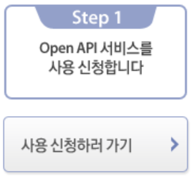
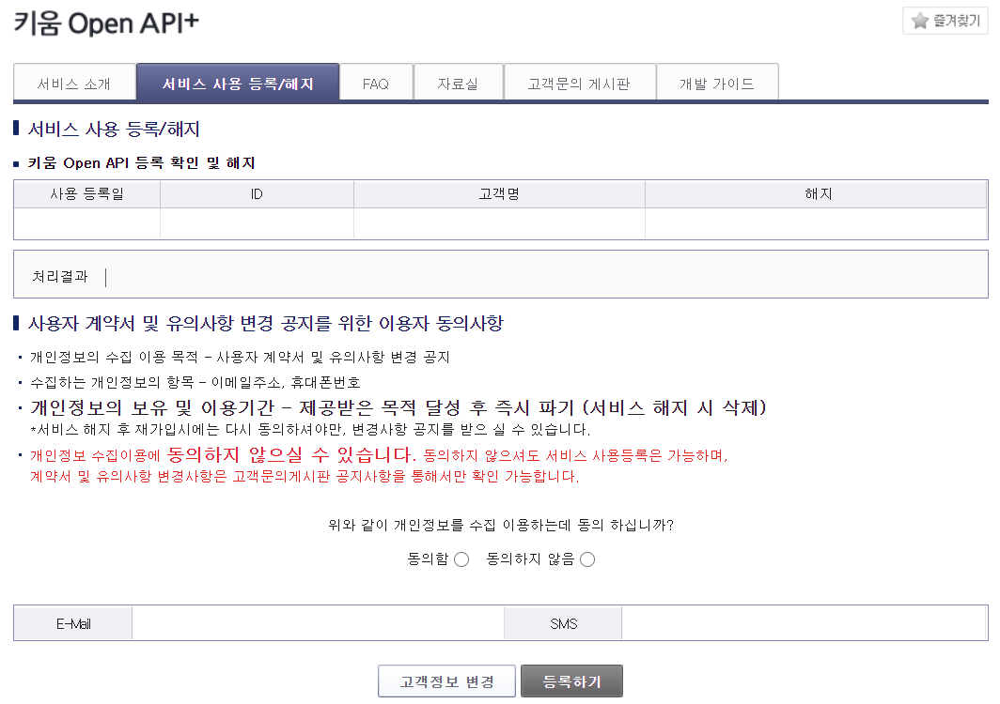
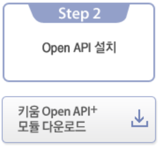
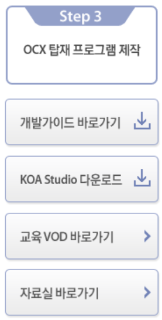

# 키움증권 OpenAPI 가이드

## What is it

해당 가이드는 키움증권 OpenAPI에서 제공하는 대부분의 기능을 빠르게 사용할 수 있도록
이해를 도와줍니다.

 

## Guide Contents

+ [키움증권이란?](#키움증권이란)
+ [키움 OpenAPI+란?](#키움-openapi-란)
+ [키움증권 OpenAPI사용법](#키움증권-openapi사용법)
    + [키움증권 OpenAPI 신청하기](#키움증권-openapi-신청하기)
    + [키움증권 OpenAPI 모듈 다운로드하기](#키움증권-openapi-모듈-다운로드하기)
+ [키움증권 OpenAPI 시작하기](#키움증권-openapi-시작하기)
+ [아나콘다 설치하기](#아나콘다-설치하기)
+ [vscode 설치하기](#vscode-설치하기)
+ [아나콘다에서 vscode열기](#아나콘다에서-vscode열기)
+ [vscode에서 python 버전 설정하기](#vscode에서-python-버전-설정하기)
+ [python PyQt5 모듈 설치하기](#python-pyqt5-모듈-설치하기)
+ [PyQt5모듈 gui 띄우기](#pyqt5모듈-gui-띄우기)
+ [PyQt5모듈을 이용하여 키움증권 OpenAPI 연동하기](#pyqt5모듈을-이용하여-키움증권-openapi-연동하기)
+ [PyQt5모듈을 이용하여 키움증권 OpenAPI 로그인하기](#pyqt5모듈을-이용하여-키움증권-openapi-로그인하기)
+ [PyQt5모듈을 이용하여 키움증권 OpenAPI 로그인 상태 확인하기](#pyqt5모듈을-이용하여-키움증권-openapi-로그인-상태-확인하기)
+ [PyQt5모듈을 이용하여 키움증권에 로그인 후 다양한 정보 가져오기](#pyqt5모듈을-이용하여-키움증권에-로그인-후-다양한-정보-가져오기)
+ [PyQt5모듈을 이용하여 로그인 버전처리하기](#pyqt5모듈을-이용하여-로그인-버전처리하기)
+ [PyQt5모듈을 이용하여 키움증권 조회와 실시간데이터처리하기](#pyqt5모듈을-이용하여-키움증권-조회와-실시간데이터처리하기)
+ [PyQt5모듈을 이용하여 키움증권 주문과 잔고처리하기](#pyqt5모듈을-이용하여-키움증권-주문과-잔고처리하기)
+ [PyQt5모듈을 이용하여 키움증권 조건검색하기](#pyqt5모듈을-이용하여-키움증권-조건검색하기)
+ [PyQt5모듈을 이용하여 키움증권 기타함수 사용하기](#pyqt5모듈을-이용하여-키움증권-기타함수-사용하기)

 

* * *

  

+ ### 키움증권이란?

    > 키움증권은 대한민국의 증권사이다 다우기술의 자회사이다.

    [키움증권 홈페이지 링크](https://www1.kiwoom.com/)

     

    + 키움증권 정보
        
         

        + 국가: 대한민국
        + 고객 서비스: 1544-9000
        + 본사: 서울특별시 영등포구
        + CEO: 이현(2018.3.22 ~ )
        + 창립: 2000년 1월 31일
        + 본사 소재지: 서울특별시 영등포구 여의나루로4길 18 (여의도동)
        + 사업 내용: 증권중개업
        + 자회사: 키움투자자산운용, 키움프라이빗에쿼티, 키움저축은행, 키움캐피탈, 키움에프앤아이
        + 모회사: 다우기술
        + 제품: 개인위탁중개, 주식, 채권, CP 등 법인중개영업, 유가증권매매 등

 

+ ### 키움 OpenAPI+ 란?

    > 키움증권에서 제공하는 OpenAPI+ 서비스명으로 고객이 직접 당사가 제공하는 모듈을 이용하여 시세조회/잔고조회/주문 등의 기능을 사용할 수 있도록 제공하는 서비스입니다.

    + #### 키움 Open API+ 사용 요건

        당사 계좌를 보유하고 HTS ID를 연결하신 고객님께서는 모두 이용 가능하며, ‘서비스 사용등록’ 탭에서 사용 등록 후 바로 이용 가능합니다.

 

+ ### 키움증권 OpenAPI사용법

     

    + #### 키움증권 OpenAPI 신청하기

        [키움증권 OpenAPI 신청 링크](https://www3.kiwoom.com/nkw.templateFrameSet.do?m=m1408010600)
        
        위의 링크에 들어간 다음 로그인하고

         

        

         

        Step1 사용신청하러 가기 버튼을 누르고

        

        하단의 동의함버튼을 누른 다음 등록하기 버튼을 누르면된다.

        > E-Mail, SMS, ID, 고객명, 해지 등의 개인정보는 가렸다.

         

    + #### 키움증권 OpenAPI 모듈 다운로드하기

        python에서 키움증권 OpenAPI기능을 사용하기 위해서는 모듈을 다운받아야된다.
        키움증권 OpenAPI모듈을 다운받기 위해서는 

        [키움증권 OpenAPI 신청 링크](https://www3.kiwoom.com/nkw.templateFrameSet.do?m=m1408010600)

        위의 링크에 들어간 후 

         

        

        Step2 의 키움 Open API+ 모듈 다운로드 버튼을 누르면 OpenAPISetup.exe 파일이 다운로드 하고

        해당 OpenAPISetup.exe파일을 실행시킨 후 쭉 다운로드 진행하면 된다.

 

+ ### 키움증권 OpenAPI 시작하기

    + #### 키움증권 OpenAPI KOA Studio 다운로드

        KOA Studio프로그램은 다양한 정보와 OpenAPI 개발 가이드가 들어있는 프로그램이다.
        만약 구글링을 해도 안나올 경우에는 해당 프로그램을 참고하여도 좋다.

        KOA Studio프로그램을 다운로드 하기 위해서는

         

        

        Step3에 있는 KOA Studio 다운로드 버튼을 누르면 KOAStudioSA.zip 파일이 다운로드가 되는데 해당 파일을 압축해제 하고 KOAStudioSA.exe 프로그램을 클릭하여 실행시키면

        

        이처럼 키움증권 Open API 개발가이드가 있는것을 볼 수 있다.

 

+ ### 아나콘다 설치하기

 

+ ### vscode 설치하기

 

+ ### 아나콘다에서 vscode열기

 

+ ### vscode에서 python 버전 설정하기

 

+ ### python PyQt5 모듈 설치하기

 

+ ### PyQt5모듈 gui 띄우기

 

+ ### PyQt5모듈을 이용하여 키움증권 OpenAPI 연동하기

 

+ ### PyQt5모듈을 이용하여 키움증권 OpenAPI 로그인하기

 

+ ### PyQt5모듈을 이용하여 키움증권 OpenAPI 로그인 상태 확인하기

 

+ ### PyQt5모듈을 이용하여 키움증권에 로그인 후 다양한 정보 가져오기

 

+ ### PyQt5모듈을 이용하여 로그인 버전처리하기

 

+ ### PyQt5모듈을 이용하여 키움증권 조회와 실시간데이터처리하기

 

+ ### PyQt5모듈을 이용하여 키움증권 주문과 잔고처리하기

 

+ ### PyQt5모듈을 이용하여 키움증권 조건검색하기

 

+ ### PyQt5모듈을 이용하여 키움증권 기타함수 사용하기

 
