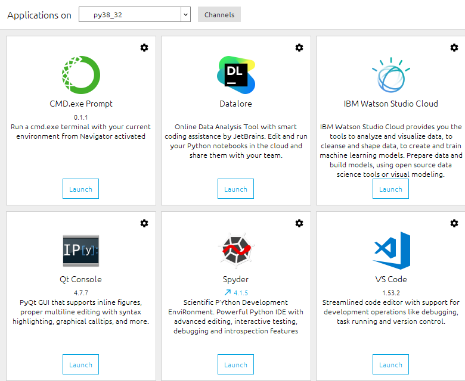
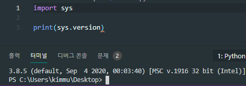

# 키움증권 OpenAPI 가이드

## What is it

해당 가이드는 키움증권 OpenAPI에서 제공하는 대부분의 기능을 빠르게 사용할 수 있도록
이해를 도와줍니다.

<br>

## Guide Contents

+ [키움증권이란?](#키움증권이란)
+ [키움 OpenAPI+란?](#키움-openapi-란)
+ [키움증권 OpenAPI사용법](#키움증권-openapi사용법)
    + [키움증권 OpenAPI 신청하기](#키움증권-openapi-신청하기)
    + [키움증권 OpenAPI 모듈 다운로드하기](#키움증권-openapi-모듈-다운로드하기)
+ [키움증권 OpenAPI 시작하기](#키움증권-openapi-시작하기)
+ [아나콘다 설치하기](#아나콘다-설치하기)
+ [vscode 설치하기](#vscode-설치하기)
+ [아나콘다에서 vscode열기](#아나콘다에서-vscode열기)
+ [vscode에서 python 버전 설정하기](#vscode에서-python-버전-설정하기)
+ [python PyQt5 모듈 설치하기](#python-pyqt5-모듈-설치하기)
+ [PyQt5모듈 gui 띄우기](#pyqt5모듈-gui-띄우기)
+ [PyQt5모듈을 이용하여 키움증권 OpenAPI 연동하기](#pyqt5모듈을-이용하여-키움증권-openapi-연동하기)
+ [PyQt5모듈을 이용하여 키움증권 OpenAPI 로그인하기](#pyqt5모듈을-이용하여-키움증권-openapi-로그인하기)

<br>

* * *

<br><br>

+ ### 키움증권이란?

    > 키움증권은 대한민국의 증권사이다 다우기술의 자회사이다.

    [키움증권 홈페이지 링크](https://www1.kiwoom.com/)

    <br>

    + 키움증권 정보
        
        <br>

        + 국가: 대한민국
        + 고객 서비스: 1544-9000
        + 본사: 서울특별시 영등포구
        + CEO: 이현(2018.3.22 ~ )
        + 창립: 2000년 1월 31일
        + 본사 소재지: 서울특별시 영등포구 여의나루로4길 18 (여의도동)
        + 사업 내용: 증권중개업
        + 자회사: 키움투자자산운용, 키움프라이빗에쿼티, 키움저축은행, 키움캐피탈, 키움에프앤아이
        + 모회사: 다우기술
        + 제품: 개인위탁중개, 주식, 채권, CP 등 법인중개영업, 유가증권매매 등

<br>

+ ### 키움 OpenAPI+ 란?

    > 키움증권에서 제공하는 OpenAPI+ 서비스명으로 고객이 직접 당사가 제공하는 모듈을 이용하여 시세조회/잔고조회/주문 등의 기능을 사용할 수 있도록 제공하는 서비스입니다.

    + #### 키움 Open API+ 사용 요건

        당사 계좌를 보유하고 HTS ID를 연결하신 고객님께서는 모두 이용 가능하며, ‘서비스 사용등록’ 탭에서 사용 등록 후 바로 이용 가능합니다.

<br>

+ ### 키움증권 OpenAPI사용법

    <br>

    + #### 키움증권 OpenAPI 신청하기

        [키움증권 OpenAPI 신청 링크](https://www3.kiwoom.com/nkw.templateFrameSet.do?m=m1408010600)
        
        위의 링크에 들어간 다음 로그인하고

        <br>

        

        <br>

        Step1 사용신청하러 가기 버튼을 누르고

        

        하단의 동의함버튼을 누른 다음 등록하기 버튼을 누르면된다.

        > E-Mail, SMS, ID, 고객명, 해지 등의 개인정보는 가렸다.

        <br>

    + #### 키움증권 OpenAPI 모듈 다운로드하기

        python에서 키움증권 OpenAPI기능을 사용하기 위해서는 모듈을 다운받아야된다.
        키움증권 OpenAPI모듈을 다운받기 위해서는 

        [키움증권 OpenAPI 신청 링크](https://www3.kiwoom.com/nkw.templateFrameSet.do?m=m1408010600)

        위의 링크에 들어간 후 

        <br>

        

        Step2 의 키움 Open API+ 모듈 다운로드 버튼을 누르면 OpenAPISetup.exe 파일이 다운로드 하고

        해당 OpenAPISetup.exe파일을 실행시킨 후 쭉 다운로드 진행하면 된다.

<br>

+ ### 키움증권 OpenAPI 시작하기

    + #### 키움증권 OpenAPI KOA Studio 다운로드

        KOA Studio프로그램은 다양한 정보와 OpenAPI 개발 가이드가 들어있는 프로그램이다.
        만약 구글링을 해도 안나올 경우에는 해당 프로그램을 참고하여도 좋다.

        KOA Studio프로그램을 다운로드 하기 위해서는

        <br>

        

        Step3에 있는 KOA Studio 다운로드 버튼을 누르면 KOAStudioSA.zip 파일이 다운로드가 되는데 해당 파일을 압축해제 하고 KOAStudioSA.exe 프로그램을 클릭하여 실행시키면

        

        이처럼 키움증권 Open API 개발가이드가 있는것을 볼 수 있다.

    + #### 키움증권 OpenAPI KOA Studio 프로그램 실행 오류

        <br>

        키움증권 OpenAPI KOA Studio프로그램을 실행하는 도중 [파일이름].dll 오류가 난다면

        [키움증권 KOA Studio 오류 해결](https://github.com/kimminwyk/stockOpenAPI#-opstarter) 
        해당 링크를 참고하면 된다.
<br>

+ ### 아나콘다 설치하기

일반적으로 키움증권 OpenAPI를 PyQt5모듈로 사용흘 하게되는데

키움증권 OpenAPI모듈은 32비트에서만 원활하게 사용이 가능하므로
아나콘다를 설치하여 가상 32bit환경을 만들어주도록 해야한다.

[아나콘다 32bit 다운로드 링크](https://www.anaconda.com/products/individual)

해당 아나콘다 프로그램 설치 완료한 다음 

윈도우키 눌르고 anaconda prompt 프로그램을 실행한 다음

```bash
set CONDA_FORCE_32BIT=1
conda create -n py37_32 python=(원하는 python버전대) anaconda
conda activate py37_32

ex)
set CONDA_FORCE_32BIT=1
conda create -n py38_32 python=3.8 anaconda
conda activate py38_32
```

위의 커멘를 입력하면 py38_32 이름으로 원하는 python 버전대 32비트 가상환경이 만들어지게 된다.

<br>

+ ### vscode 설치하기

그리고 python를 사용하기위해서는 에디터를 사용하기때문에
python을 실행하기 좋은 에디터(파이참, vscode, 주피터 등)가 많이 존재하지만

가벼운 용량에 그리 나쁘지않고 편한 vscode를 사용할것이다.

vscode 에디터를 사용하기 위해서는 

[vscode 다운로드 링크](https://code.visualstudio.com/download)에 들어가서 자신의 운영체제에 맞게 다운로드하면 된다.

<br>

+ ### 아나콘다에서 vscode열기

아나콘다와 vscode 다운로드가 완료되었다면



윈도우키를 누른다음 Anaconda Navigator 프로그램을 실행시킨 다음 위의 사진대로 

Applications on을 자신이 만든 py[이름]으로 바꾸고 VS Code 부분의 Launch버튼을 누르면 된다.

정상적으로 vscode가 실행하고
자신이 설정한 python버전대가 맞는지 확인하는 쉬운 방법은

```py
import sys
print(sys.version)
```

위의 파이썬 소스코드를 그대로 쓴다음



Ctrl + F5단축키를 눌러 실행시키면 해당 사진처럼 (파이썬 버전대) (default, (시간)) [환경 상태]이런 형식으로 되어있는데

우측 환경상태 부분에 64bit가 아닌 32bit라고 뜨면 성공이다.

<br>

+ ### vscode에서 python 버전 설정하기

만약 아나콘다에서 일일히 vscode실행하기 싫거나 여러 파이썬 버전대를 사용하고 싶을때는

vscode를 실행한 다음

단축키<Ctrl+Shift+p>를 누르면 창이 하나 뜨게되는게 거기에서 Python: Select interpreter을 입력한 다음 누르면 파이썬 버전대 여러개가 나오게되는데

우리가 사용할려는 python 버전대를 클릭한 다음 실행하면 된다.

<br>

+ ### python PyQt5 모듈 설치하기

python은 어떠한 모듈을 pip로 설치하기 위해서는

```bash
pip install <module name>
```
이런식으로 콘솔에 입력해야된다.

윈도우의 경우 파워쉘이나 cmd에 입력하면 된다.

```bash
pip install PyQt5
```

위의 명령어 그대로 입력하면 다운로드가 되는것을 볼 수 있다.

<br>

+ ### PyQt5모듈 gui 띄우기

PyQt5 모듈을 정상적으로 설치에 완료했다면

```py
import sys
from PyQt5.QtWidgets import *
from PyQt5.QtGui import  *
from PyQt5.QAxContainer import *

class MyWindow(QMainWindow):
    def __init__(self):
        super().__init__()

if __name__ == "__main__":
    app = QApplication(sys.argv)
    myWindow = MyWindow()
    myWindow.show()
    app.exec_()
```

이 소스코드를 이용하여 실행시키면 gui가 띄워진다.

<br>

+ ### PyQt5모듈을 이용하여 키움증권 OpenAPI 로그인하기

```py
import sys
from PyQt5.QtWidgets import *
from PyQt5.QtGui import  *
from PyQt5.QAxContainer import *

class MyWindow(QMainWindow):
    def __init__(self):
        super().__init__()

        self.kiwoom = QAxWidget("KHOPENAPI.KHOpenAPICtrl.1")
        self.kiwoom.dynamicCall("CommConnect()")

        self.kiwoom.OnEventConnect.connect(self.event_connect)

    def event_connect(self, err_code):
        if err_code == 0:
            print('로그인 성공')
            
if __name__ == "__main__":
    app = QApplication(sys.argv)
    myWindow = MyWindow()
    myWindow.show()
    app.exec_()
```

위의 소스코드를 이용하여 키움증권 OpenAPI를 사용하기 위해 QAxWidget 라는 함수로 KHOPENAPI.KHOpenAPICtrl.1를 호출한 다음
dynamicCall를 이용하여 로그인을 하기 위해 CommConnect() 함수를 넣으면 된다.